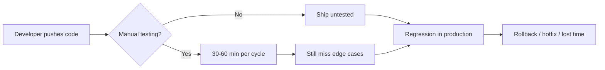
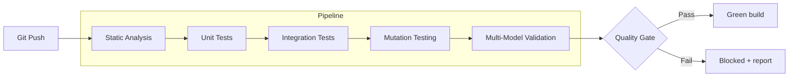
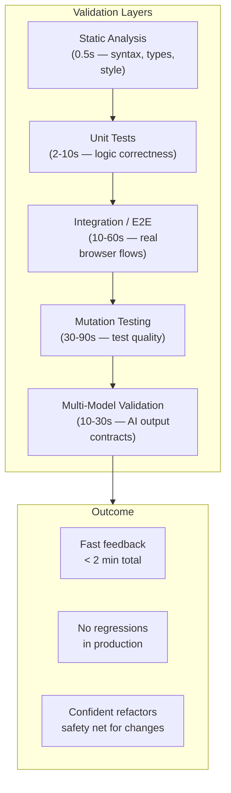

# Test Harness — Automated Quality Gate

[](LICENSE)
[](https://github.com/nerudek/test-harness)
[](https://github.com/nerudek/test-harness/pulls)

Catch regressions before they ship. A comprehensive test harness that runs static analysis, unit tests, integration tests, mutation testing, and multi-model validation — automatically, on every commit.

---

## The Problem

One "small fix" breaks three other features. Manual testing takes 30+ minutes per cycle and still misses edge cases. AI-generated code lands without tests. Regressions slip into production because there is no automated safety net.



The result: slow feedback loops, fragile releases, and creeping technical debt.

---

## What It Does

This harness gives every project an automated quality gate — a pipeline of checks that runs in seconds, not minutes, and validates everything from static types to LLM outputs.



Checks include:
- **Static analysis** — ESLint, TypeScript type checking, Prettier formatting
- **Unit tests** — Vitest with instant watch mode and coverage thresholds
- **Integration tests** — Playwright E2E with auto-retry and sharding
- **Mutation testing** — Stryker to find gaps in your test coverage
- **Multi-model validation** — Run the same assertions against multiple AI models to ensure consistent output

---

## Why Not Just ... ?

| Instead of ... | Test Harness gives you |
|---|---|
| Relying on CI alone | A full local + CI quality gate that runs before you push |
| Manual QA checklists | Automated checks that never forget a step |
| Single test runner | Five complementary validation layers in one config |
| One-model AI testing | Multi-model contract validation across different LLMs |
| Just coverage numbers | Mutation testing that reveals actual test quality |

---

## Agent Compatibility

Works with any development agent or CLI tool. Drop the commands into your workflow and the harness handles the rest.

---

## Quick Start

```bash
# 1. Install dependencies
npm install --save-dev vitest @testing-library/react happy-dom

# 2. Add scripts to package.json
npm pkg set scripts.test="vitest run"
npm pkg set scripts.test:watch="vitest"
npm pkg set scripts.test:coverage="vitest run --coverage"
npm pkg set scripts.test:mutation="stryker run"

# 3. Run the full gate
npm test && npx tsc --noEmit && npx stryker run
```

That's it. Every push now runs lint, type checks, tests, coverage, and mutation analysis.

---

## How It Works

Each layer catches a different class of bug — and they build on each other.



- **Layer 1 (Static)** — Catches syntax errors, type mismatches, and formatting issues instantly. Zero setup, runs in under a second.
- **Layer 2 (Unit)** — Validates individual functions and components in isolation. Fast enough to run on every keystroke in watch mode.
- **Layer 3 (Integration)** — Tests real user flows: page loads, navigation, form submission, API calls. Catches integration bugs units miss.
- **Layer 4 (Mutation)** — Automatically mutates your code (e.g. `>` → `<`) and checks whether tests catch the change. Surviving mutants = coverage blind spots.
- **Layer 5 (Multi-Model)** — Sends the same prompt to multiple LLMs and validates responses against a shared contract: JSON shape, language, length, sentiment, required fields.

---

## Stats

| Metric | Target |
|---|---|
| Line coverage | ≥ 80% |
| Branch coverage | ≥ 70% |
| Function coverage | ≥ 80% |
| Mutation score | ≥ 75% |
| CI pipeline time | < 3 min |
| Model validation timeout | 30s per model |

---

## Installation

```bash
git clone https://github.com/nerudek/test-harness.git
cd test-harness
npm install
```

Then configure your test files in the `tests/` directory (see Quick Start above for scripts).

---

## Repository Structure

```
test-harness/
├── README.md            # This file
├── SKILL.md             # Complete skill/guide documentation
├── package.json         # Dependencies and scripts (add yours)
├── tests/
│   ├── unit/            # Vitest unit tests
│   ├── integration/     # Playwright E2E tests
│   ├── mutation/        # Stryker mutation config
│   └── models/          # Multi-model validation tests
├── .github/
│   └── workflows/       # GitHub Actions CI pipeline
└── LICENSE
```

---

## Known Problems

1. **Flaky E2E tests** — Playwright's `waitForSelector` helps; avoid arbitrary `sleep()` calls
2. **Mutation testing is slow** on large codebases — scope to covered lines with `--mutate` flag
3. **Multi-model validation** depends on model API availability and rate limits — cache responses for repeat runs
4. **Coverage thresholds** can encourage surface-level testing — pair with mutation score for real quality
5. **Snapshot tests** are brittle — prefer assertion-based tests for UI validation

---

## Contributing

PRs are welcome! If you find a gap in the harness or want to add support for a new test layer, open an issue first to discuss the approach.

1. Fork the repo
2. Create a feature branch
3. Add tests for your changes
4. Verify the full quality gate passes locally
5. Submit a pull request

---

## License & Support

MIT License. See [LICENSE](LICENSE) for details.

If this saved you time: [PayPal.me/nerudek](https://www.paypal.me/nerudek)

GitHub: [github.com/nerudek](https://github.com/nerudek)
